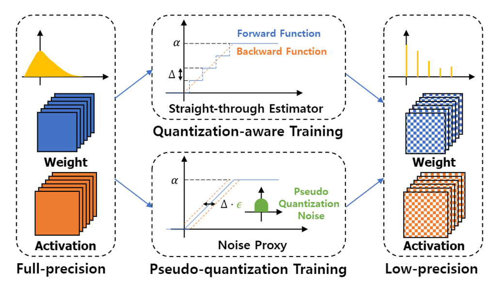

# [CVPR 2023] NIPQ: Noise Proxy-Based Integrated Pseudo-Quantization [[Paper]](https://openaccess.thecvf.com/content/CVPR2023/papers/Shin_NIPQ_Noise_Proxy-Based_Integrated_Pseudo-Quantization_CVPR_2023_paper.pdf) [[Slides]](TBA) [[Video]](https://youtu.be/omfqsWVIMx8)

This is official code for the paper [NIPQ: Noise Proxy-Based Integrated Pseudo-Quantization](https://openaccess.thecvf.com/content/CVPR2023/papers/Shin_NIPQ_Noise_Proxy-Based_Integrated_Pseudo-Quantization_CVPR_2023_paper.pdf). NIPQ samples accurate pseudo-quantization noise(PQN), while integrating learnable truncation parameter in pseudo-quantization training(PQT) pipeline. Bit-width is automatically allocated considering layer-wise sensitivity.




## How to use
You can reproduce the result of MobileNet-v2 for avgbit and bops options
* Optimize average bit-width  
```
sh run_mv2_imagenet_ts_avgbit.sh
```

+ Optimize bops
```
sh run_mv2_imagenet_ts_bops.sh
```

For experimental details and hyper-paramters, please refer to the paper and `train.py` file

       

## Installation  
+ Python verseion >= 3.7.13 
+ Pytorch >= 1.12.1
+ ImageNet Dataset (Set `data` option of `train.py`)
+ Using docker:
```
docker run -v {local_code_loc}:{container_code_loc} -v {local_dataset_loc}:{container_dataset_loc} -it --gpus=all pytorch/pytorch:1.12.1-cuda11.3-cudnn8-devel 
```


## Citation
```BibTex  
@InProceedings{Shin_2023_CVPR,
    author    = {Shin, Juncheol and So, Junhyuk and Park, Sein and Kang, Seungyeop and Yoo, Sungjoo and Park, Eunhyeok},
    title     = {NIPQ: Noise Proxy-Based Integrated Pseudo-Quantization},
    booktitle = {Proceedings of the IEEE/CVF Conference on Computer Vision and Pattern Recognition (CVPR)},
    month     = {June},
    year      = {2023},
    pages     = {3852-3861}
}
``` 

